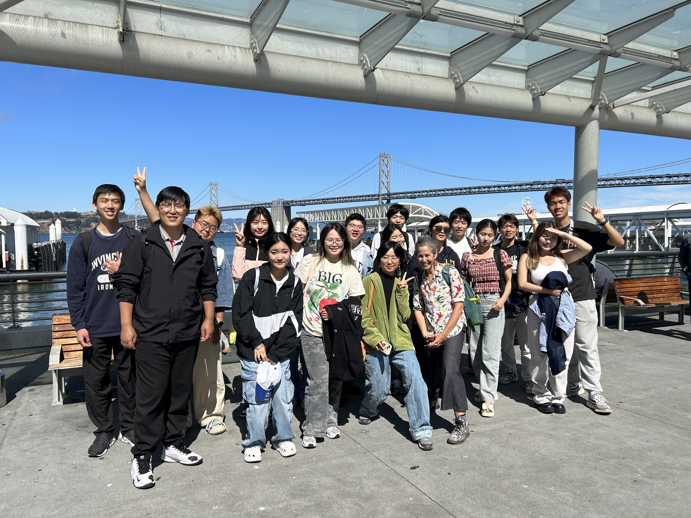

## Beyond Research

Outside of research, I find meaning and balance through photography, cultural exploration, and global learning experiences. These moments outside the lab not only help me stay grounded, but often provide fresh perspectives that enrich my academic work.

## Photography

I love photography. It's been a part of my life since high school, helping me document people, places, and moments I care about. Recently, I’ve grown especially fond of shooting with film. There's something really special about the slow, deliberate process and the surprise of seeing how each shot turns out.

  
  
  
  

## Global Experiences

- **UC Berkeley Summer Session** — Summer 2023  
  Participated in a three-week academic summer program. It was a meaningful experience that gave me a taste of the academic culture in the U.S. and helped me reflect on my future direction.

  

    
  

- **Sustainable Innovation Workshop, Bali** — Summer 2024
  Attended a workshop in Bali focused on sustainable design and global innovation strategies. Engaged with students and professionals from diverse backgrounds and presented a poster about my second-year research projects.

  

    
  

- **Northeastern University, Boston** — Fall 2024  
  Semester-long exchange program. Immersed in the U.S. academic environment, collaborated with international peers, and deepened my appreciation for interdisciplinary research and cultural diversity.

  

    
  

- **Spain Social Practice Program** — February 2025  
  Participated in a Tsinghua-led social practice program focused on international collaborative innovation. We visited Barcelona and Madrid, exploring topics such as urban development, sustainability, and cross-cultural exchange.

  

    
  
